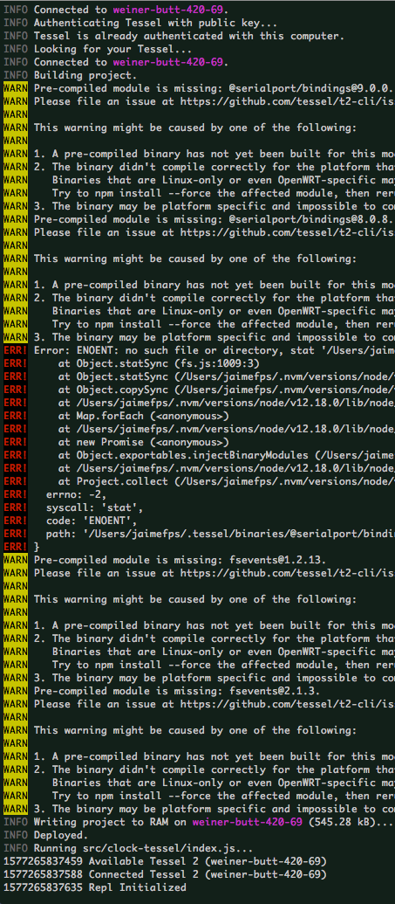

# Clock

Wait for Gif to load!

## Description

A small repo for working through musings on "separation of concerns" and OOP with Compositional pattern. The intent is to see how much code can be reused across different execution environments for a Javascript Clock program.

## Required to operate

- Node.js v 12.18.0

#### IMPORTANT

Change your Node.js version before running `npm install`.
Executions may break if you change Node.js version after installing dependencies.

## Setup Web Clock

1. Install dependencies: `npm install`
2. Run web clock with: `npm run start:web`

## Setup Arduino Led Clock

1. Install dependencies: `npm install`
2. Open Arduino Editor on your machine.
3. Go to `File` > `Examples` > `Firmata` > `StandardFirmataPlus`
4. Upload `StandardFirmataPlus` code into the Arduino.
5. Run arduino clock with: `npm run start:arduino:led`

## Setup Arduino Servo Clock

1. Install dependencies: `npm install`
2. Open Arduino Editor on your machine.
3. Go to `File` > `Examples` > `Firmata` > `StandardFirmataPlus`
4. Upload `StandardFirmataPlus` code into the Arduino.
5. Run arduino clock with: `npm run start:arduino:servo`

## Setup Tessel2 Servo Clock

1. Install dependencies: `npm install`
2. Install t2 CLI: `npm install -g t2-cli`
3. Run tessel clock with: `npm run start:tessel:servo`

#### IMPORTANT

When the `Building project` step begins. Wait about a minute before killing the process, you may see a long list of `WARN` and `ERR!` logs. Many of these errors can be ignored. There seem to be missing some unused dependencies regarding `@serialport/bindings`.

## TODO

- Arduino Servo Clock Diagrams
- Tessel2 Servo Clock Diagrams
- Arduino and Tessel2 LED Clocks
